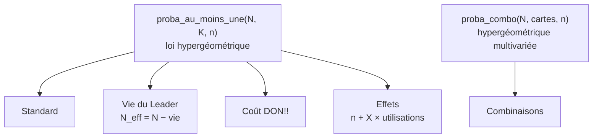

# One Piece TCG — Deck Probability Analyzer

> Calculateur de probabilités pour le One Piece Card Game : « quelle est ma chance
> d'avoir cette carte en main au tour 3 ? »

<p>
  
  
  
  
  
</p>

---

## Sommaire

- [Le problème](#le-problème)
- [Aperçu](#aperçu)
- [Fonctionnalités](#fonctionnalités)
- [Démarrage rapide](#démarrage-rapide)
- [Les cinq onglets en détail](#les-cinq-onglets-en-détail)
- [Fondement mathématique](#fondement-mathématique)
- [Règles OPTCG modélisées](#règles-optcg-modélisées)
- [Structure du projet](#structure-du-projet)
- [Hypothèses et limites](#hypothèses-et-limites)
- [Feuille de route](#feuille-de-route)
- [Contribuer](#contribuer)
- [Licence et mentions](#licence-et-mentions)

---

## Le problème

Construire un deck One Piece, c'est arbitrer en permanence entre des intuitions :
*« est-ce que 3 copies suffisent ? »*, *« est-ce que je vois ma carte assez tôt
pour la jouer à la courbe ? »*, *« est-ce que mes searchers compensent le fait de
ne jouer que 2 exemplaires ? »*.

Ces questions ont des réponses chiffrées exactes. Ce projet les calcule et les
affiche sous forme de tableaux et de courbes, en tenant compte des règles
réelles du jeu — vie du Leader retirée du deck, position 1er / 2e joueur,
rythme de pose des DON!!.

## Aperçu

Le projet existe en **deux implémentations indépendantes**, qui exposent les
mêmes cinq modules de calcul :

| Version | Fichier | Pour qui |
|---|---|---|
| **Web** | `site/` | Utilisation immédiate — en ligne, ou un double-clic sur `site/index.html` |
| **Bureau** | `opctg_probabilite.py` | Environnement Python, graphiques Matplotlib |

La version web est un **site statique sans étape de build** : pas de bundler,
pas de dépendance, pas de CDN. Les graphiques sont dessinés en `<canvas>` natif,
et le dossier `site/` se sert tel quel par n'importe quel serveur web.

## Fonctionnalités

- **Cinq calculateurs** couvrant la pioche, la courbe de jeu, les effets de
  recherche et les combinaisons de cartes
- **Tableau + graphique synchronisés** pour chaque calcul, mis à jour en direct
- **Comparaison 1x / 2x / 3x / 4x** sur un même graphique — l'argument chiffré
  pour trancher un choix de deckbuilding
- **Axe X commutable** : nombre de cartes vues, ou numéro de tour
- **Base de cartes intégrée** (version web) : recherche multilingue, filtres et
  fiches complètes, servies par le site lui-même — aucun appel à un tiers
- **Interface en français**, terminologie officielle du jeu (DON!!, Leader, vie)

## Démarrage rapide

### Version web — recommandée

Le site est en ligne : **<https://opdeck.hokhori.be>**. Rien à installer.

Pour le faire tourner en local :

```bash
git clone https://github.com/AKHMerban/One-Piece-TCG-Probability-Calculator.git
cd One-Piece-TCG-Probability-Calculator
open site/index.html             # macOS
# xdg-open site/index.html  (Linux)  |  start site\index.html  (Windows)
```

Aucune installation. La recherche de carte par nom nécessite une connexion
internet ; sans réseau, tout le reste du calculateur continue de fonctionner.

### Version bureau (Python)

**Prérequis** — Python 3.8 ou supérieur (pour `math.comb`), Tkinter et Matplotlib.

```bash
pip install matplotlib
python opctg_probabilite.py
```

> Tkinter est inclus dans la plupart des distributions Python. Sur Debian/Ubuntu :
> `sudo apt install python3-tk`.

## Les cinq onglets en détail

### 1. Standard — probabilité de pioche

Le calcul de base. On saisit la taille du deck, une liste de « cartes vues »
(`5,6,7,10,15,20`) et on obtient, pour 1 à 4 copies, la probabilité d'en voir au
moins une.

### 2. Vie du Leader — deck effectif

En début de partie, la vie du Leader (3 à 6) est retirée du dessus du deck et
mise de côté face cachée. Ces cartes ne sont pas piochables : le deck effectif
est donc `N − vie`. Cet onglet applique cette correction et ajoute le choix de
la position (1er / 2e joueur), qui remplit automatiquement les cartes vues tour
par tour.

### 3. Coût DON!! — le tour idéal

Croise deux courbes : le DON!! disponible tour par tour et la probabilité
d'avoir la carte en main. Réponse produite : **à partir de quel tour la carte
est à la fois payable et statistiquement en main**. Option « garder du DON!!
en réserve » pour modéliser un contre ou un effet à activer.

### 4. Effets supplémentaires — searchers et filtrage

On empile des effets, chacun avec une valeur X et un nombre d'utilisations :

- *Recherche* — regarder les X premières cartes du deck
- *Pioche X / Défausse X* — filtrage

Chaque effet ajoute `X × utilisations` cartes vues au calcul.

### 5. Combinaisons — plusieurs cartes à la fois

Jusqu'à 5 cartes, chacune avec son nombre de copies dans le deck et un
**minimum requis**. Permet de répondre à : *« quelle est ma probabilité d'avoir
2 copies de ce personnage **et** 1 copie de cet Event avant le tour 3 ? »*

### 6. Cartes — la base complète du jeu

Recherche et filtres sur l'intégralité des cartes : nom, numéro, type, texte
d'effet, couleur, catégorie, coût, attribut, extension. Chaque fiche affiche le
visuel et toutes les métadonnées — coût ou vie, puissance, contre, couleur,
attribut, types, effet, extension.

La recherche porte sur **les deux langues à la fois** : chercher « Blocker »
trouve aussi les cartes dont le texte français dit « Bloqueur ». Les onglets
*Coût DON!!* et *Combinaisons* puisent dans cette même base pour préremplir
leurs champs.

## Fondement mathématique

Tous les onglets s'appuient sur un moteur commun.



### Au moins une copie

Piocher `n` cartes dans un deck de `N` contenant `K` copies de la carte
recherchée, sans remise : la probabilité d'en voir au moins une est le
complémentaire du cas « aucune copie ».

$$P(\text{au moins 1}) = 1 - \frac{\binom{N-K}{n}}{\binom{N}{n}}$$

### Combinaison de cartes

Pour plusieurs cartes avec un minimum requis pour chacune, le code somme
directement toutes les répartitions valides selon la **loi hypergéométrique
multivariée**. Le nombre de cartes étant borné à 5, le calcul reste instantané.

$$P = \sum_{\substack{k_i \geq r_i}} \frac{\left(\prod_i \binom{K_i}{k_i}\right)\binom{N - \sum K_i}{\;n - \sum k_i}}{\binom{N}{n}}$$

## Règles OPTCG modélisées

| Règle | Modélisation |
|---|---|
| Vie du Leader (3 / 4 / 5 / 6) | Retirée du deck piochable : `N_eff = N − vie` |
| 1er joueur | Ne pioche pas au tour 1 ; 1 DON!! au T1, puis +2 par tour |
| 2e joueur | Pioche dès le tour 1 ; +2 DON!! par tour dès le T1 |
| Plafond DON!! | 10 DON!! au total |
| Main de départ | 5 cartes par défaut, paramétrable |

## Structure du projet

```
.
├── site/                        ← le site web, servi tel quel (aucun build)
│   ├── index.html               ← l'application, 6 onglets
│   ├── 404.html
│   ├── robots.txt · sitemap.xml · site.webmanifest
│   └── assets/
│       ├── styles.css           ← thème + responsive + impression
│       ├── app.js               ← moteur de calcul et rendu des graphiques
│       ├── cards.js             ← base de cartes : recherche, filtres, fiches
│       └── favicon.svg
├── tools/
│   ├── scrape-cards.py          ← construit la base depuis le site officiel
│   └── fetch-card-images.py     ← télécharge et convertit les visuels en WebP
├── opctg_probabilite.py         ← version bureau de référence (5 onglets)
├── opctg_probabilite copie.py   ← copie de travail, règle DON!! antérieure
├── opctg_probabiliteV.py        ← prototype : Standard + Vie du Leader
├── PROB.py                      ← prototype initial : calcul de base
└── README.md
```

Les fichiers `PROB.py` et `opctg_probabiliteV.py` sont conservés comme **étapes
historiques** du développement. Pour utiliser l'application, se référer à
`opctg_probabilite.py` ou à la version web.

## La base de cartes

Les données proviennent du **site officiel du jeu**, reconstruites par les deux
scripts de `tools/`.

```bash
# 1. Métadonnées : une requête par extension, espacées d'une seconde
python3 tools/scrape-cards.py --out site/data

# 2. Visuels : PNG officiels convertis en WebP (~26 % de la taille)
python3 tools/fetch-card-images.py --manifest site/data/images.txt --out site/data/cards
```

Deux catalogues sont fusionnés : l'anglais sert de base parce qu'il est complet
(60 extensions), le français est superposé carte par carte là où il existe
(37 extensions). Une carte récente s'affiche donc en anglais, une carte plus
ancienne en français — l'interface le signale.

Les **parallèles et alternatives** (`OP01-001_p1`, `_r1`…) sont repliées sur
leur carte de base : elles partagent toutes les données de jeu et ne diffèrent
que par l'artwork. Leurs identifiants restent listés dans le champ `variants`.

Le dossier `site/data/` n'est **pas versionné** : c'est de la donnée dérivée,
régénérable, et les visuels pèsent plusieurs centaines de mégaoctets. Le site
la charge à la demande, à la première ouverture de l'onglet *Cartes*.

## Hypothèses et limites

À garder en tête pour interpréter correctement les résultats :

- **Le jeu adverse est ignoré.** Aucune modélisation du blocage, des KO ou des
  effets adverses. Le « tour idéal » est un optimum théorique, à ajuster en partie.
- **Les cartes de vie ne sont jamais révélées.** Le modèle les retire du deck ;
  il ne simule pas les dégâts subis qui les feraient rejoindre la main.
- **Les effets sont modélisés en cartes vues.** « Pioche 2 / Défausse 2 » est
  compté comme 2 cartes vues supplémentaires : cela mesure bien le *filtrage*,
  mais pas l'effet de la défausse sur la composition de la main.
- **Les mulligans ne sont pas pris en compte.**

## Feuille de route

- [x] Probabilité de pioche par nombre de cartes vues
- [x] Probabilité tour par tour, avec position 1er / 2e joueur
- [x] Vie du Leader et deck effectif
- [x] Recherche (top X) et pioche/défausse cumulables
- [x] Combinaisons de cartes avec minimum requis
- [x] Analyse par coût en DON!! et tour idéal
- [x] Version web autonome, sans dépendance
- [x] Base de cartes complète, recherche et filtres
- [ ] Import d'une decklist complète et analyse globale
- [ ] Modélisation fine du mulligan
- [ ] Traduction anglaise de l'interface
- [ ] Export des tableaux et graphiques (CSV / PNG)

## Contribuer

Les contributions sont bienvenues.

1. Forker le dépôt et créer une branche : `git checkout -b feat/ma-fonctionnalite`
2. Garder les deux versions cohérentes : une nouvelle règle de calcul devrait
   idéalement être portée côté Python **et** côté HTML
3. Documenter toute formule ajoutée dans la docstring de la fonction
4. Ouvrir une Pull Request décrivant le calcul et la règle du jeu concernée

Les rapports de bug (« cette probabilité me semble fausse ») sont particulièrement
utiles : préciser les paramètres saisis et le résultat attendu.

## Licence et mentions

Aucune licence n'est actuellement déclarée pour ce dépôt. En l'absence de
licence, le code reste sous le droit d'auteur exclusif de son auteur.

Les données et visuels des cartes proviennent du site officiel
[onepiece-cardgame.com](https://en.onepiece-cardgame.com/cardlist/) et restent
la propriété de leurs ayants droit. Ils sont reproduits ici à des fins
d'information pour les joueurs, sans usage commercial.

*One Piece Card Game* est une marque de Bandai. Ce projet est un outil
communautaire non officiel, sans aucune affiliation avec Bandai ou Eiichiro Oda.
